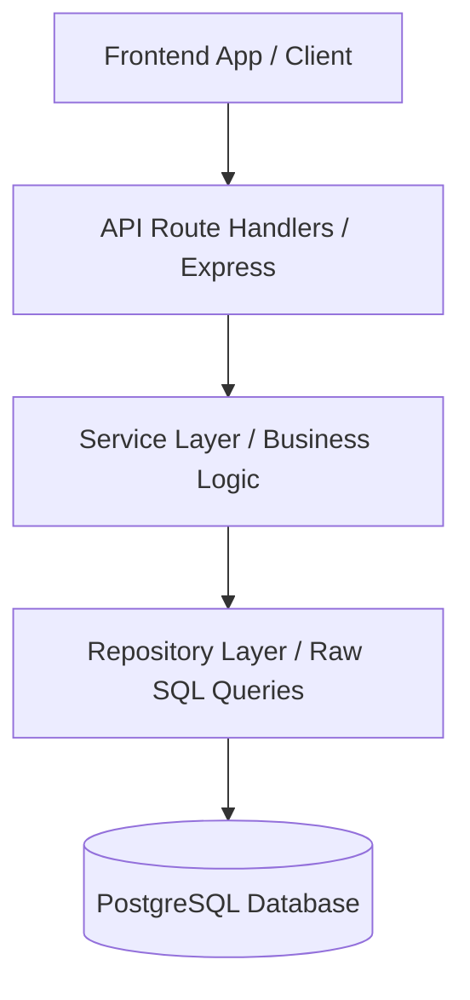

# Platform Architecture & Security Reference Manual
**Status:** ✅ Refactoring Complete & Hardened  
**Last Updated:** July 17, 2026  
**Supersedes:** 16 archived architectural audits, guides, and bug logs in `/docs/archive/by-topic/architecture/`.

---

## 🏗️ Three-Tier Architecture

The Digitpen Hub Suite is structured into a clean three-tier architecture that decouples HTTP/routing layers from core database queries and business calculations:

### 1. Route Handlers (`backend/src/routes/` & `controllers/`)
*   Responsible for route definition, authentication checks (JWT), role validation (`hasRole`), and HTTP response/request formatting.
*   *Migration Detail:* Controllers have been refactored to delegate complex workflows to their corresponding Service classes.

### 2. Service Layer (`backend/src/services/`)
*   Handles core transactions, validation checks, custom error throwing, and integration points with third-party APIs (e.g. Pexels, Flutterwave).
*   Enforces organizational scoping rules (ensuring org-specific calculations).

### 3. Repository Layer (`backend/src/repositories/` or Direct Safe Queries)
*   Executes parameter-safe SQL queries to interface with PostgreSQL tables.
*   Enforces security by sanitizing inputs and using prepared statements to avoid SQL injection risks.

---

## 🔒 Security Hardening Framework

The platform has been hardened based on prior audits:

1.  **Rate Limiting:** Enforced globally on public routes and specifically on sensitive modules (e.g. `/api/v1/auth`, `/api/v1/hr`, and CSV export routes) using rate-limiting middleware.
2.  **Input Validation:** Robust JSON schema checks and input type conversions applied before data updates.
3.  **Cross-Tenant Scoping (IDOR Prevention):** All queries verify tenant ownership by mapping `req.user.orgId` directly to the select/update filters.
4.  **Row Locking:** Core transaction operations (e.g., Billing payments) utilize PostgreSQL row locking (`SELECT ... FOR UPDATE`) to prevent race conditions during concurrent requests.
